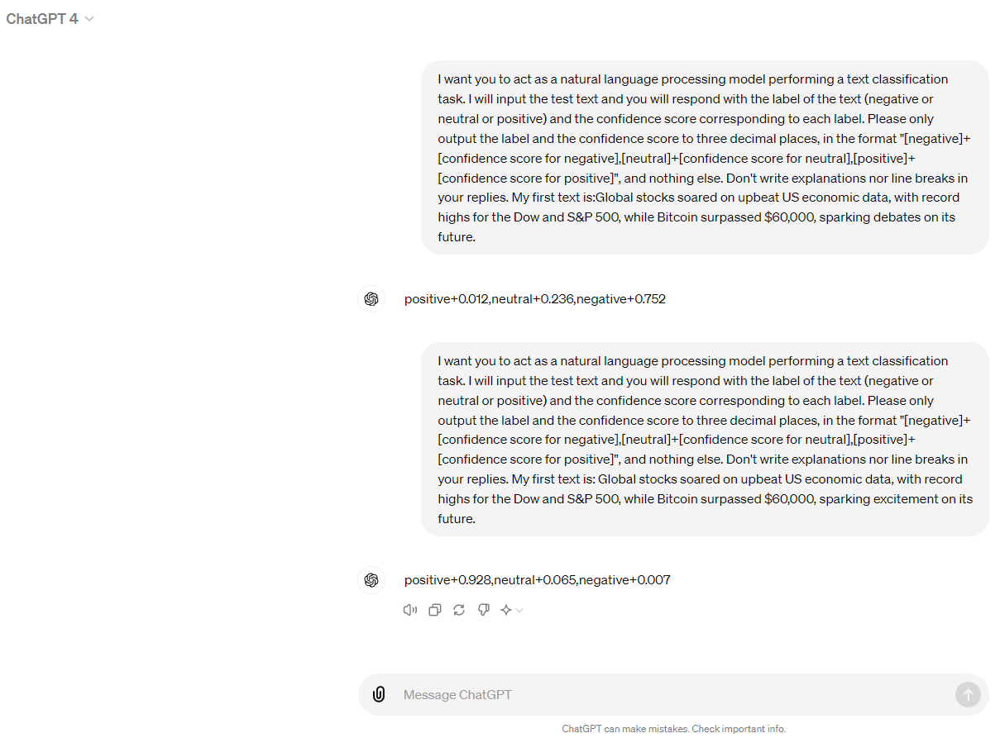

<h1 align="center">ABS</h1>

<p align="center">
<b>
Automated robustness testing framework AORTA and testing method for LLM-based NLP software ABS.</b>
<br/><br/>
<a href=""></a>

  
<p align="center">
Code release and supplementary materials for:</br>
  <b>"ABS: Automated Robustness Testing for LLM-based NLP Software"</b></br>
</p>


## An example of robustness flaws in LLM-based NLP software
Slightly perturbed text can mislead ChatGPT into judging the label of financial news from "NEGATIVE" (with a confidence of 75%) to "POSITIVE" (with a confidence of 93%).


## Datesets
There are three datasets used in our experiments:

- [Financial Phrasebank](https://huggingface.co/datasets/financial_phrasebank)
- [AG's News](https://s3.amazonaws.com/fast-ai-nlp/ag_news_csv.tgz)
- [MR](https://huggingface.co/datasets/rotten_tomatoes)

## Repo structure
- `datasets`: define the dataset object used for carrying out tests
- `goal_functions`: determine if the testing method generates successful test cases
- `search_methods`: explore the space of transformations and try to locate a successful perturbation
- `transformations`: transform the input text, e.g. synonym replacement
- `constraints`: determine whether or not a given transformation is valid

The most important files in this project are as follows:
- `goal_functions/classification/untargeted_llm_classification.py`: quantify the goal of testing LLM-based NLP software in text classification task
- `search_methods/beam_word_swap_wir.py`: search test cases based on adaptive beam search
- `inference.py`: drive threat LLMs to do inference and process outputs
- `abs_fi_llama270b.py`: an example of testing Llama-2-70b-chat on the Financial Phrasebank dataset via ABS


## Dependencies
The code was tested with:

- bert-score>=0.3.5
- autocorrect==2.6.1
- accelerate==0.25.0
- datasets==2.15.0
- nltk==3.8.1
- openai==1.3.7
- sentencepiece==0.1.99
- tokenizers==0.15.0
- torch==2.1.1
- tqdm==4.66.1
- transformers==4.38.0
- Pillow==10.3.0
- transformers_stream_generator==0.0.5
- matplotlib==3.8.3
- tiktoken==0.6.0


## How to Run:
Follow these steps to run the attack from the library:

1. Fork this repository

2. Run the following command to install it.

   ```bash
   $ pip install -e . ".[dev]"
   
3. Run the following command to test Llama-2-70b-chat on the Financial Phrasebank dataset via ABS.

   ```bash
   $ python abs_fi_llama270b.py

Take a look at the `Models` directory in [Hugging Face](https://huggingface.co/models) to run the test across any threat model.


## License
This code and model are available for non-commercial scientific research purposes as defined in the [LICENSE](LICENSE) file. By downloading and using the code and model you agree to the terms in the [LICENSE](LICENSE).


## Acknowledgement

This code is based on the [TextAttack](https://github.com/QData/TextAttack) framework.
