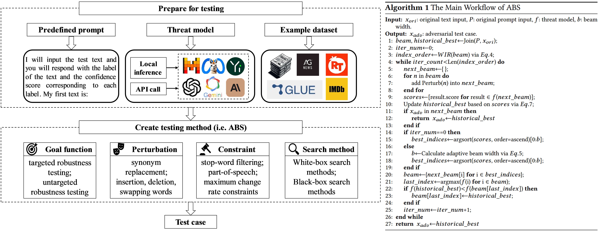

<h1 align="center">Automated Robustness Testing for LLM-based Natural Language Processing Software</h1>

<p align="center">
<b>
Automated robustness testing framework AORTA and testing method for LLM-based NLP software ABS.</b>
<br/><br/>
<a href=""></a>


## An example of robustness flaws in LLM-based NLP software
Slightly perturbed text can mislead ChatGPT into judging the label of overall input from "NEGATIVE" (with a confidence of 91%) to "POSITIVE" (with a confidence of 96%).


## Datesets
There are three datasets used in our experiments:

- [Financial Phrasebank](https://huggingface.co/datasets/financial_phrasebank)
- [AG's News](https://s3.amazonaws.com/fast-ai-nlp/ag_news_csv.tgz)
- [MR](https://huggingface.co/datasets/rotten_tomatoes)

## Repo structure
- `datasets`: define the dataset object used for carrying out tests
- `goal_functions`: determine if the testing method generates successful test cases
- `search_methods`: explore the space of transformations and try to locate a successful perturbation
- `transformations`: transform the input text, e.g. synonym replacement
- `constraints`: determine whether or not a given transformation is valid

The most important files in this project are as follows:
- `goal_functions/classification/untargeted_llm_classification.py`: quantify the goal of testing LLM-based NLP software in text classification task
- `search_methods/beam_word_swap_wir.py`: search test cases based on adaptive beam search
- `inference.py`: drive threat LLMs to do inference and process outputs
- `abs_fi_llama270b.py`: an example of testing Llama-2-70b-chat on the Financial Phrasebank dataset via ABS


## Dependencies
The code was tested with:

- bert-score>=0.3.5
- autocorrect==2.6.1
- accelerate==0.25.0
- datasets==2.15.0
- nltk==3.8.1
- openai==1.3.7
- sentencepiece==0.1.99
- tokenizers==0.15.0
- torch==2.1.1
- tqdm==4.66.1
- transformers==4.38.0
- Pillow==10.3.0
- transformers_stream_generator==0.0.5
- matplotlib==3.8.3
- tiktoken==0.6.0


## How to Run:
Follow these steps to run the attack from the library:

1. Fork this repository

2. Run the following command to install it.

   ```bash
   $ pip install -e . ".[dev]"
   
3. Run the following command to test Llama-2-70b-chat on the Financial Phrasebank dataset via ABS.

   ```bash
   $ python abs_fi_llama270b.py

Take a look at the `Models` directory in [Hugging Face](https://huggingface.co/models) to run the test across any threat model.


## Test methods available via AORTA
| Method | Paper |
|:-----|:----:|
| CheckList | [Beyond Accuracy: Behavioral Testing of NLP Models with CheckList](https://www.ijcai.org/proceedings/2021/659) |
| StressTest | [Stress Test Evaluation for Natural Language Inference](https://aclanthology.org/C18-1198/) |
| PWWS | [Generating Natural Language Adversarial Examples through Probability Weighted Word Saliency](https://www.aclweb.org/anthology/P19-1103/) |
| TextBugger | [TextBugger: Generating Adversarial Text Against Real-world Applications](https://www.ndss-symposium.org/ndss-paper/textbugger-generating-adversarial-text-against-real-world-applications/) |
| TextFooler | [Is BERT Really Robust? A Strong Baseline for Natural Language Attack on Text Classification and Entailment](https://ojs.aaai.org/index.php/AAAI/article/view/6311) |
| BAE | [BAE: BERT-based Adversarial Examples for Text Classification](https://aclanthology.org/2020.emnlp-main.498/) |
| BERT-attack | [BERT-ATTACK: Adversarial Attack Against BERT Using BERT](https://aclanthology.org/2020.emnlp-main.500/) |
| CLARE | [Contextualized Perturbation for Textual Adversarial Attack](https://aclanthology.org/2021.naacl-main.400/) |
| DeepWordBug | [Black-box Generation of Adversarial Text Sequences to Evade Deep Learning Classifiers](https://ieeexplore.ieee.org/document/8424632) |
| Alzantot | [Generating Natural Language Adversarial Examples](https://aclanthology.org/D18-1316/) |
| Faster-Alzantot | [Certified Robustness to Adversarial Word Substitutions](https://aclanthology.org/D19-1423/) |
| IGA | [Natural Language Adversarial Defense through Synonym Encoding](https://proceedings.mlr.press/v161/wang21a.html) |
| LEAP | [LEAP: Efficient and Automated Test Method for NLP Software](https://ieeexplore.ieee.org/abstract/document/10298415/) |
| PSO | [Word-level Textual Adversarial Attacking as Combinatorial Optimization](https://www.aclweb.org/anthology/2020.acl-main.540/) |
| Pruthi | [Combating Adversarial Misspellings with Robust Word Recognition](https://aclanthology.org/P19-1561/) |
| Kuleshov | [Adversarial Examples for Natural Language Classification Problems](https://openreview.net/pdf?id=r1QZ3zbAZ) |
| Input-reduction | [Pathologies of Neural Models Make Interpretations Difficult](https://pdfs.semanticscholar.org/18eb/c6dfa3ed6096e6200cc74b8d29c75c13706d.pdf) |
| ABS | [Automated Robustness Testing for LLM-based Natural Language Processing Software](https://arxiv.org/abs/2412.21016) |

## Supplementary
### Comparison results of ABS in RQ2 with three currently best performing baselines
In Section VI, RQ2, due to space limitations, we selected only one currently best-performing method, PWWS, to compare with ABS across each dataset and threat model. Below are the complete experimental results regarding time overhead (T-O, s/item) and query numbers (Q-N). 


| Dataset    | Baseline | Mistral-7B T-O | Mistral-7B Q-N | Llama2-13b T-O | Llama2-13b Q-N | Internlm2-20b T-O | Internlm2-20b Q-N | Yi-34B  T-O | Yi-34B Q-N | Llama2-70b T-O | Llama2-70b Q-N |
|------------|----------|----------------|----------------|----------------|----------------|-------------------|-------------------|------------|------------|----------------|----------------|
| FP         | TextFooler| 1023.188       | 514.852        | 756.675        | 446.977        | 204.795           | 241.569           | 1977.952   | 474.875    | 1701.354       | 415.736        |
| FP          | TextBugger| 808.073        | 489.866        | 988.749        | 566.625        | **184.506**           | **215.295**           | 1112.685   | 462.657    | 2146.771       | 534.240        |
|FP            | PWWS     | 791.666        | 484.505        | 649.829        | 377.265        | 689.686           | 505.563           | 2154.301   | 436.776    | 2940.494       | 357.525        |
|FP            | **ABS**      | **743.134**    | **455.645**    | **626.414**    | **357.815**    | 624.420       | 501.955       | **800.675**| **416.390**| **1434.164**   | **353.565**    |
| AG's_News  | TextFooler| 1567.436       | 542.081        | 1874.576       | 537.791        | 3156.738          | 2258.813          | 1907.659   | 696.704    | 10364.629      | 1895.846       |
| AG's_News           | TextBugger| 1565.676       | 1070.030       | 1863.738       | 529.664        | 2989.445          | 2118.238          | 2060.292   | 785.792    | 10553.323      | 1971.058       |
| AG's_News           | PWWS     | 1035.338       | 390.065        | 1540.594       | 458.808        | 2862.853          | 1222.527          | 5158.118   | 718.121    | 10719.804      | 1135.557       |
| AG's_News           | **ABS**      | **1023.188**   | **379.058**    | **1514.230**    | **454.059**     | **2652.858**      | **1003.760**       | **1716.228**| **677.754**| **8028.515**   | **953.638**    |
| MR         | TextFooler| 793.138        | 937.776        | 1540.594       | 458.388        | 591.972           | 1056.336          | 822.228    | 626.322    | 4566.902       | 929.819        |
|MR            | TextBugger| 800.622        | 952.212        | **763.479**        | 462.005        | 684.152           | 1156.253          | 872.208    | 687.476    | 4828.464       | 980.144        |
|MR            | PWWS     | 584.902        | 622.365        | 877.955        | 459.885        | 548.436           | 645.441           | 1901.666    | 532.535    | 5645.228       | 951.331        |
|MR            | **ABS**      | **526.115**    | **596.635**    | 994.455    | **449.874**     | **496.329**       | **599.263**       | **658.702**| **502.926**| **4401.065**   | **755.121**    |


In most cases, ABS generates successful test cases with lower time overhead and query numbers. This efficiency is especially critical in LLM-based software testing, as it significantly reduces testing costs and enables more accurate robustness evaluations within a limited time.

## License
This code and model are available for non-commercial scientific research purposes as defined in the [LICENSE](LICENSE) file. By downloading and using the code and model you agree to the terms in the [LICENSE](LICENSE).


## Acknowledgement

This code is based on the [TextAttack](https://github.com/QData/TextAttack) framework.
